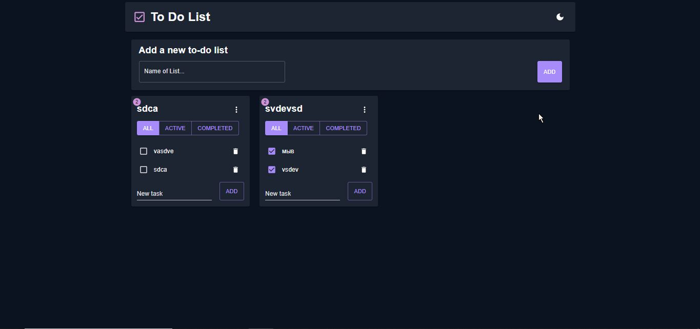
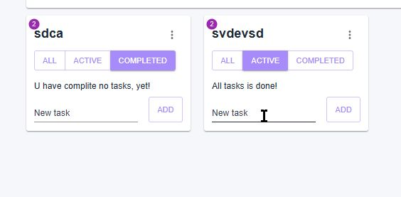
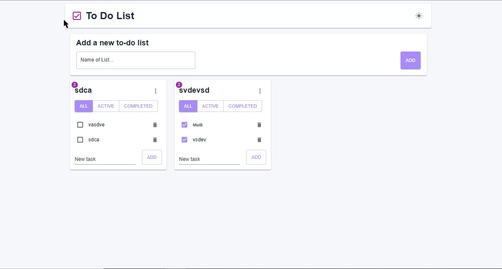

# ReactNotes

Полный пример приложения "ToDo / Notes" на React + TypeScript.

## Краткое описание

ReactNotes — CRUD-приложения со списками задач (todolists). Проект демонстрирует:

- Управление состоянием через `@reduxjs/toolkit` и асинхронные операции (thunks)
- Взаимодействие с REST API через `axios` и слой API-обёрток
- UI на Material UI (`@mui/material`) с темизацией (light/dark)
- Тесты на `vitest` (юнит-тесты в папке `__tests__`)
- Оптимизация рендерига с `memo`, `useCallback`

Проект подготовлен с целью демонстрации навыков построения архитектуры фронтенда, организации слоёв и практик работы с оптимизацией, типами и асинхронностью.

## Технологии

- **Язык:** TypeScript
- **Фреймворк:** React 19
- **Бандлер:** Vite
- **Состояние:** Redux Toolkit (`@reduxjs/toolkit`, `react-redux`)
- **UI:** Material UI (`@mui/material`, `@mui/icons-material`)
- **HTTP:** axios
- **Тестирование:** Vitest

## Быстрый старт

Требования:

- Node.js (рекомендованная версия: 19+)
- pnpm (проект содержит `pnpm-lock.yaml` — используйте `pnpm` для установки)

Установка зависимостей:

```bash
pnpm install
```

Запуск в режиме разработки:

```bash
pnpm run dev
```

Запуск тестов (Vitest):

```bash
pnpm run test
```

## Переменные окружения

Проект использует `axios` instance, настроенный через `import.meta.env`.
Создайте `.env` в корне проекта (или используйте ваш способ переменных) со следующими переменными:

`Временные токены можете запросить лично в переписке. Либо зарегестрировавшись на сайте https://social-network.samuraijs.com/`

```env
VITE_BASE_URL=https://social-network.samuraijs.com/api/1.1
VITE_TOKEN=your_token_here
VITE_API=your_api_key_here
```

## Структура проекта (ключевые папки)

- `src/` — исходники приложения
    - `src/main.tsx` — точка входа
    - `src/app/` — конфигурация Redux, `App.tsx`, глобальные слайсы
    - `src/commun/` — общие утилиты, хелперы, instance axios и shared компоненты
    - `src/features/todolists/` — бизнес-логика приложения (API, model, UI)
        - `api/` — работа с REST API (`todolistsApi`, `tasksApi`)
        - `model/` — Redux slices и async thunks (`todolists-slice.ts`, `tasks-slice.ts`)
        - `ui/` — UI компоненты (ToDoLists, CardItem, Tasks и т.д.)

Файлы входа и конфигурации:

- `vite.config.ts` — конфигурация Vite
- `tsconfig.json` / `tsconfig.app.json` — настройки TypeScript
- `package.json` — скрипты и зависимости

## API и слоёвая архитектура

- `src/commun/instance/instance.ts` создаёт `axios`-инстанс с базовым URL и заголовками (см. переменные окружения).
- `src/features/todolists/api` содержит обёртки над HTTP запросами (`todolistsApi`, `tasksApi`).
- `src/features/todolists/model` реализует асинхронные thunk-операции через удобный `createAppSlice` (сокращённая обёртка для создания slice + thunks).

Это делает бизнес-логику изолированной от UI и упрощает покрытие тестами.

## Тесты

- В проекте есть заготовки для юнит-тестов в `src/features/todolists/model/__tests__/` — сейчас они закомментированы, но структура готова для наполнения.
- Запуск: `pnpm run test`

## Демострация








